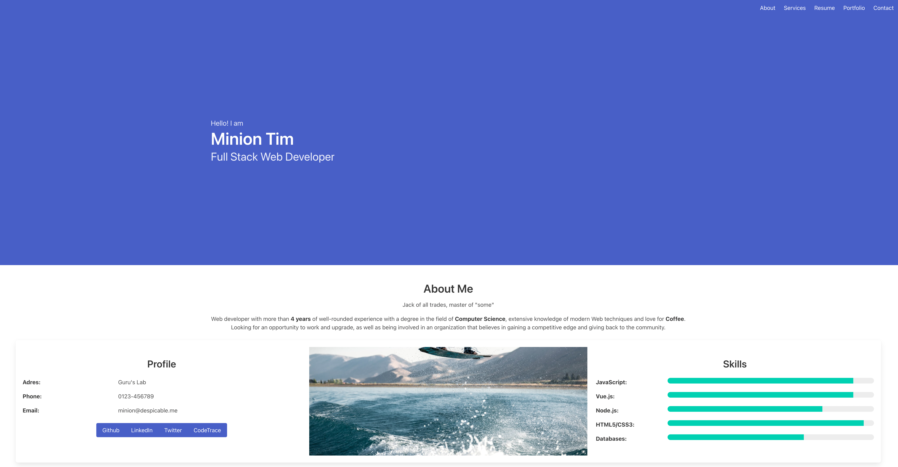

[](https://github.com/websight-io/bulma/actions/workflows/ci.yml)
# Bulma

Bulma is a sample component library for the [WebSight CMS](https://www.websight.io/) based on [Bulma](https://bulma.io/).


## Using

### Separate project
This project delivers everything what is needed to run as a separate project. All you need is just [build](#build) and [run](#how-to-run) local environment.

### Using on existing environment
To use this project on existing environment you have to use a command from section ['Build bundles with local deployment'](#build-bundles-with-local-deployment)


## Modules
- `application` - components related code and scripts
  - `backend` - backend code and scripts
  - `frontend` - frontend code and scripts
- `content` - sample content built with delivered components
- `distribution` - builds a distribution of the project - instance feature model and docker images for runtime components
- `environment` - contains scripts and files used to build environment
  - `local` - starts local environment
- `tests` - responsible for the automatic distribution validation
  - `content` - contains content used for end-to-end tests
  - `end-to-end` - end-to-end tests validating distribution

## Development

### Build
```bash
./mvnw clean install
```

### Build bundles with local deployment
```bash
./mvnw clean install -P autoInstallBundle
```

### How to run
Once Docker images are ready, all you need is to run Docker Compose from the `environment/local` folder:

```bash
docker compose up
```

This module uses Google Style and verifies code against its rules.

## Contributing
Please read our [Contributing Guide](./CONTRIBUTING.md) before submitting a Pull Request to the project.

## Community support
Please check the community support section in [WebSight Starter](https://github.com/websight-io/starter#community-support).

## License
Bulma components is `open-source` project with `Apache License 2.0` license.